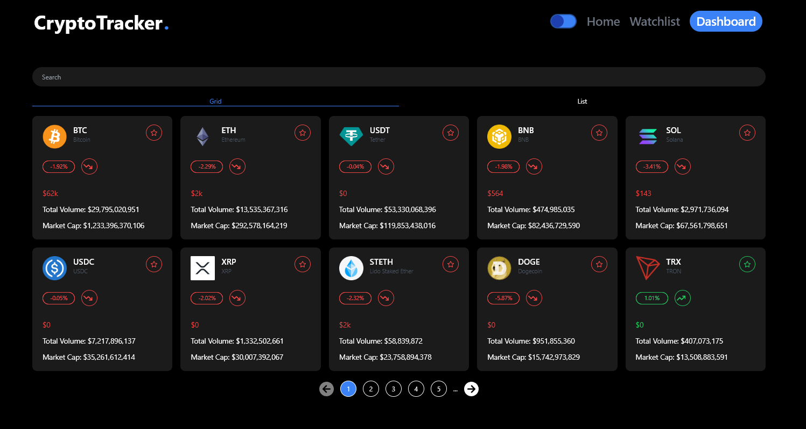
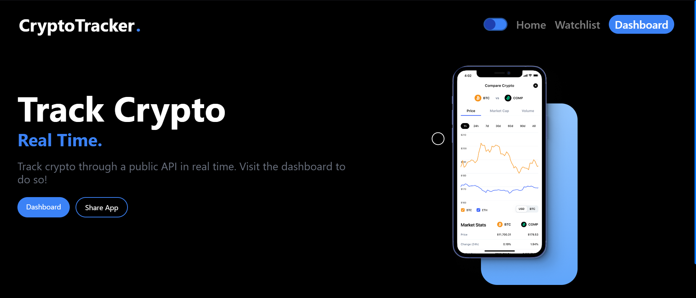

## Overview

The **CryptoTracker** allows users to track the top 100 cryptocurrencies in real-time. With an intuitive interface, users can easily view price changes, market capitalization, and trading volume for each cryptocurrency.

## Features

- **Real-Time Data**: Get live updates on the top 100 cryptocurrencies.
- **Search Functionality**: Easily search for specific cryptocurrencies.
- **User-Friendly Interface**: Simple and clean design for seamless navigation.

## Screenshots

  <!-- Replace with the path to your screenshot -->
  <!-- Replace with the path to your screenshot -->
